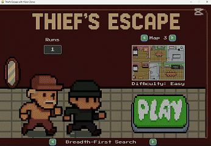
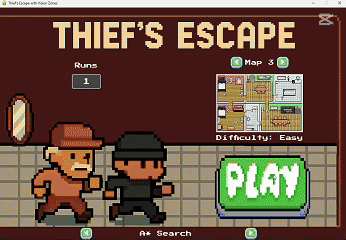
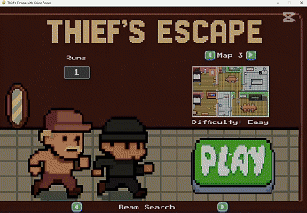
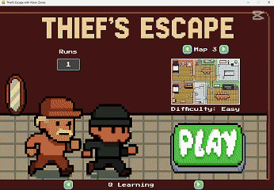

# Thief's Escape with Vision Zones

## Giới thiệu
Thief's Escape with Vision Zones là một trò chơi 2D dựa trên lưới, xây dựng bằng Pygame. Sử dụng các thuật toán AI để điều khiển tên trộm thu thập đồng xu, tìm lối ra, tránh bẫy và người chủ tuần tra. Người chủ phát hiện tên trộm trong vùng tầm nhìn sẽ kích hoạt chế độ đuổi bắt. Trò chơi hỗ trợ nhiều thuật toán AI tìm đường và bản đồ với độ khó khác nhau.


## Tính năng
- **Gameplay năng động**: Tên trộm thu thập xu, tránh bẫy và người chủ; người chủ chuyển đổi giữa tuần tra và đuổi bắt.
- **Thuật toán AI**: Hỗ trợ BFS, A*, Beam Search, Partially Observation và Q-Learning.
- **Bản đồ tùy chỉnh**: 9 bản đồ (Dễ: Map 1-3, Trung bình: Map 4-6, Khó: Map 7-9).
  - 
  - 
  - 
  - 
  - 
  - 
  - 
  - 
  - 
- **Bẫy và chi phí**: Bẫy gai và lửa gây sát thương, ảnh hưởng chi phí tìm đường.
- **Máu và thể lực**: Tên trộm có thanh máu; người chủ có thanh thể lực ảnh hưởng khả năng đuổi bắt.
- **Vùng tầm nhìn**: Vùng nhìn hình tròn, giao nhau kích hoạt đuổi bắt.
- **Âm thanh**: Nhạc nền và hiệu ứng cho nhặt xu, dính bẫy, game over.
- **Menu**: Chọn thuật toán, bản đồ, số lần chạy; tùy chọn bật/tắt âm thanh.
- **Thống kê**: Lưu kết quả (thành công/thất bại, đường đi, thời gian) vào `stats.csv`.
  - 


## Cài đặt
1. **Clone Repository**:
   ```bash
   git clone https://github.com/finntranne/DoANGameAI.git
   cd thiefs-escape
   ```
2. **Cài đặt thư viện**:
   Cài Python 3.8+ và các thư viện:
   ```bash
   pip install pygame pytmx numpy
   ```

## Cách chơi
1. **Khởi động**:
   ```bash
   python game.py
   ```
2. **Menu chính**:
   - Chọn thuật toán AI, bản đồ, số lần chạy.
   - Nhấn **Play** để bắt đầu.
3. **Gameplay**:
   - Thu thập xu, đến lối ra, tránh bẫy.
   - Người chủ tuần tra hoặc đuổi nếu phát hiện tên trộm.
   - Nhấn **ESC** để tạm dừng, bật/tắt âm thanh, hoặc quay lại menu.
4. **Kết thúc**:
   - Thành công: Đến lối ra với đủ xu.
   - Trốn thoát: Đến lối ra chưa đủ xu.
   - Thất bại: Hết máu hoặc bị bắt.
## Demo trò chơi
| Thuật toán | GIF |
|------------|-----|
| **BFS** |  |
| **ASTAR** |  |
| **PartialObservation** |  |
| **BeamSearch** |  |
| **Q-Learning** |  |

## Hiệu suất thuật toán

  - 
  - 
  - 
  - 
  - 
  
- **BFS**: Đáng tin cậy, phù hợp khi cần đảm bảo tìm đường, nhưng tốn tài nguyên và không tối ưu.
- **A***: Tốt nhất cho các bản đồ có cấu trúc rõ ràng, tối ưu về đường đi và thời gian, nhưng cần heuristic phù hợp.
- **Beam Search**: Nhanh trong một số trường hợp nhưng không đáng tin cậy, phù hợp cho các tình huống cần tốc độ hơn độ chính xác.
- **Partially Observation**: Phù hợp cho môi trường có thông tin hạn chế, nhưng hiệu suất kém khi quan sát bị giới hạn nghiêm trọng.
- **Q-Learning**: Linh hoạt, thích nghi tốt với môi trường phức tạp, nhưng tốn tài nguyên và không ổn định về đường đi.

## Tác giả
**Nhóm 3**
- Trần Hữu Thoại - 23110334
- Nguyễn Hoàng Anh Kiệt - 23110247
- Ngô Huy Hoàng - 23110220

